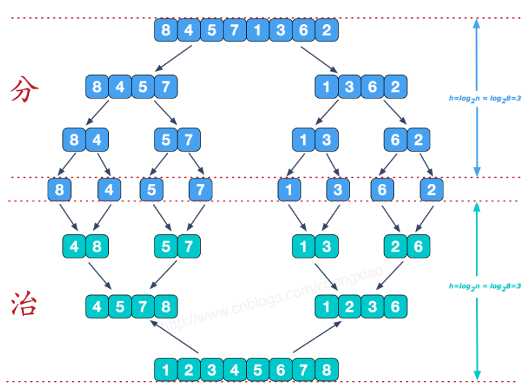

# 排序算法

## # 公共方法

```javascript
function exchange(arr, i, j){//数组元素交换位置
    let temp = 0;
    temp = arr[i];
    arr[i] = arr[j]
    arr[j] = temp
}
```


## 1. 选择排序

### 思路

1. 找到数组中最小元素
2. 将最小元素与数组第一个元素交换位置
3. 找剩余元素中最小元素，与第二个元素交换位置
4. 重复操作直至将整个数组排序

### 时间复杂度

```
(N-1)+(N-2)+...+2+1 ~ (N*N)/2
```

对于长度为N的数组，找出最小元素的比较次数每次减一，因此共有`(N*N)/2`次比较。

用大O表示法即O(n*n)。

### 代码 (JavaScript

```javascript
function selectionSort(arr){
    let N = arr.length
   	for(let i = 0; i < N; i++) {
        let min = i;
        for(let j = i+1; j < N; j++){
            if(arr[min] > a[j]) min = j
        }
        exchange(arr, i, min)
    }
}

```


## 2. 插入排序

### 思路

1. 假设数组第一个元素为有序数据
2. 将余下无序数据，依次插入至有序数据中
3. 通过比较和移动左侧数据完成插入
4. 操作至数组最右侧时排序完成

### 时间复杂度

对于长度为N的数组，最坏情况下需要`(N*N)/2`次比较和`(N*N)/2`次交换，最好情况下需要`N-1`次比较和0次交换。

用大O表示法即O(n*n)。

### 代码

```javascript
insertionSort(arr){
    let N = arr.length
    for(let i = 1; i < N; i++){
        for(let j = i; j > 0 && (arr[j] < arr[j-1]); j--){
            exchange(arr, j, j-1)
        }
    }
}
```

## 3. 希尔排序 (缩小增量排序

### 思路

1. 将数组元素分割成若干子序列，每个子序列是由数组中任意间隔为k的元素组成的（ex: 序列253196，增量为3，子序列为21/59/36
2. 对每个子序列进行插入排序
3. 缩小增量，重复2操作
4. 增量减至足够小排序完成

> 增量k的初始值时数组长度乘以一个常数因子，最小为1。
>
> 复杂度与增量k有关，具体查看[wikipedia]([https://g.zmirrordemo.com/extdomains/zh.wikipedia.org/zh/%E5%B8%8C%E5%B0%94%E6%8E%92%E5%BA%8F](https://g.zmirrordemo.com/extdomains/zh.wikipedia.org/zh/希尔排序))

### 代码

```javascript
function shellSort2(arr) {
    let N = arr.length
    let k = N >> 1 //初始化增量(步长)为数组长度*1/2
    for (; k >= 1; k>>=1) {
        for (let i = k; i < N; i++) {
            for (let j = i-k; j >= 0 && (arr[j] > arr[j+k]); j-=k) {
                exchange(arr, j, j+k)
            }
        }
    }
}
```

## 4. 归并排序

### 思路

- 归并：将两个有序数组归并为一个有序数组 
  1. 先将A数组元素复制至一个空数组B中（子数组`arr[left..mid]`和`arr[mid+1..right]`是有序的
  2. 同时遍历B的两个子数组并比较大小，依次取出归并回原数组中
- 分治：将问题拆成更小问题递归求解
  1. 递归地将当前数组平均分割成两半
  2. 分割至左右子数组仅剩一个元素，这时左右子数组是有序的
  3. 将左右子数组整合归并，逐步向顶部归并为最终有序数组



### 代码

```javascript
//归并
function merge(arr, left, mid, right){
    let i = left, j = mid+1, aux = []
    for(let k=left; k <= right; k++){
        aux[k] = arr[k] //数组复制
    }
    for(let k = left; k <= right; k++){
        if(i > mid) arr[k] = aux[j++] //左侧元素取尽后取右侧
        else if(j > right) arr[k] = aux[i++]//右侧元素取尽后取左侧
        else if(aux[j] < aux[i]) arr[k] = aux[j++]//j位置与i位置元素比较 取较小者归并
        else arr[k] = aux[i++]
    }
}
//分治
function mergeSort(arr, left, right){
    if(left == right) return //子数组中仅有一个元素时 left==right 函数退出
    let mid = (left + right) >> 1
    mergeSort(arr, left, mid)//左侧子数组排序
    mergeSort(arr, mid+1, right)//右侧子数组排序
    merge(arr, left, mid, right)//归并两侧子数组得到有序数组
}
```

## 5. 快速排序

### 思路

- 切分
  1. 从数组中取出第一个元素为基准值k
  2. 从数组右端向左遍历直到找到一个小于k的元素`arr[i]`
  3. 再从数组左端向右遍历找到一个大于k的元素`arr[j]`
  4. 交换`arr[j]`和`arr[i]`，继续2、3步操作
  5. 遍历至`i>=j`时结束切分，交换k与`arr[j]`，返回切分位置`j`
- 分治：递归调用将左右子数组切分排序

### 代码

```javascript
//切分
function partition(arr, left, right){
    let i = left, j = right+1, k = a[left]
    while(true){
        while(arr[--j] > k) if(j==left) break //找出左侧大于k的元素
        while(arr[++i] < k) if(i==right) break //找出右侧小于k的元素
        if(i >= j) break
        exchange(arr, i, j)
    }
    exchange(arr, left, j)
    return j
}
//分治
function quickSort(arr, left, right){
    if(left >= right) return
    let j = partition(arr, left, right)
    quickSort(arr, left, j-1)
    quickSort(arr, j+1, right)
}
```

